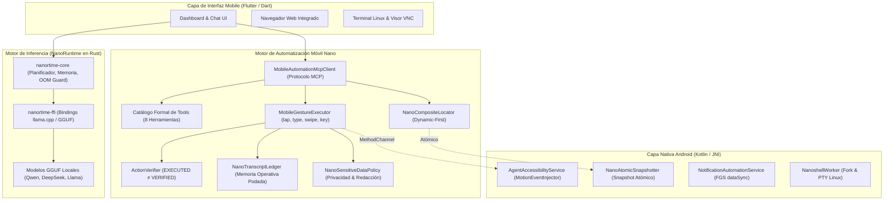
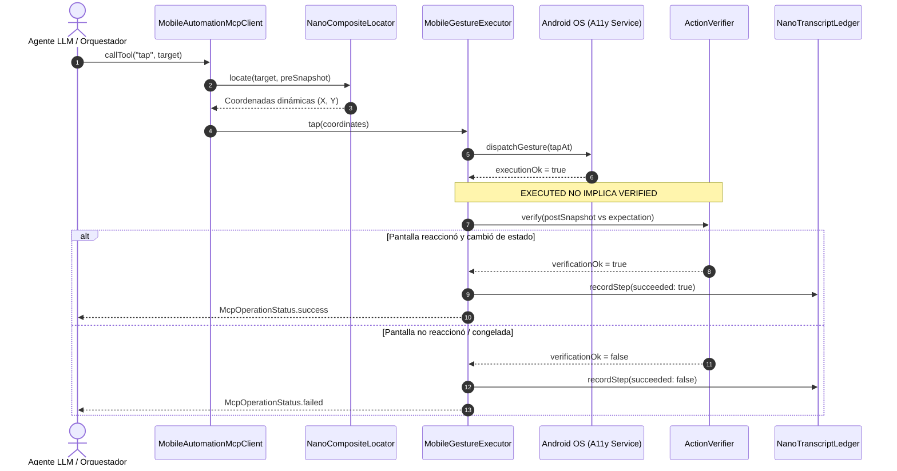
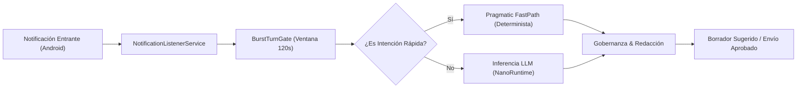

# Nano: Plataforma de Inteligencia Artificial Edge-First On-Device

**Nano** es una plataforma integral de IA local diseñada para ejecutarse de forma 100% privada, autónoma y sin dependencia de la nube directamente en dispositivos móviles y de recursos limitados.

El ecosistema se compone de dos núcleos interconectados:
1. **NanoRuntime**: Motor de inferencia LLM edge-first de ultra-baja memoria escrito en Rust puro, con degradación elegante, OOM-guard y streaming directo.
2. **NanoMobile (`nanoMOBILE`)**: Plataforma mobile en Flutter + Android nativo (Kotlin/C++) que otorga **ojos y manos reales** a los agentes mediante accesibilidad atómica, herramientas MCP estandarizadas, orquestación de mensajería y entorno Linux local.

---

## 1. Mapa de Arquitectura General



---

## 2. Flujo de Automatización Móvil: Garantía `EXECUTED ≠ VERIFIED`

Todo gesto físico sobre el dispositivo separa estrictamente el despacho de la comprobación observable de postcondición:



---

## 3. Pipeline de Mensajería y Agente Personal (WhatsApp)

Automatización respetuosa de mensajería con delimitación estricta de ráfagas, deduplicación y preservación de tono:



---

## 4. Características Principales

### A. Motor de Automatización Móvil 100% Nativo Nano
- **Captura Atómica de Jerarquía**: `NanoAtomicSnapshotter` en Kotlin congela el árbol y captura la imagen simultáneamente sin bloqueos de UI ni puertos expuestos.
- **Localización Dinámica (Dynamic-First)**: `NanoCompositeLocator` resuelve elementos por `resourceId`, texto semántico, proximidad relativa y OCR visual como fallback.
- **Gestos Adaptativos**: `AdaptiveSwipeCalculator` calcula vectores geométricos adaptándose al contenedor scrollable identificado (`RecyclerView`, `ScrollView`).
- **Gobernanza y Privacidad**: `NanoSensitiveDataPolicy` redacta contraseñas, OTPs y tokens antes de ingresar al ledger (`[REDACTADO: N caracteres]`).
- **Contratos MCP Seguros**: Herramientas mutantes declaran `readOnlyHint = false` e `idempotentHint = false`.

### B. Inferencia LLM Edge (NanoRuntime)
- **Graceful Degradation**: Reducción dinámica de ventana de contexto (8192 → 512 tokens) según presión de RAM.
- **OS-Level Memory Paging**: `madvise(DONTNEED)` por capa para varianza de RSS < 1 MB.
- **OOM Guard & Thermal Controller**: Protección activa contra el OOM Killer y reducción de carga sobre 42°C.
- **Entropy Routing**: Evaluación de confianza (`1 - H_norm`) para enrutamiento local vs asistido.

---

## 5. Mapa de Componentes del Repositorio

```text
Nanoai/
├── products/
│   ├── nanoRUNTIME/                 # Núcleo de inferencia en Rust
│   │   ├── nanortime-core/          # Orquestador, memoria, OOM guard, RAG
│   │   ├── nanortime-ffi/           # Puente FFI hacia llama.cpp / GGUF
│   │   └── nanortime-cli/           # CLI de desarrollo y testing
│   │
│   └── nanoMOBILE/                  # Plataforma móvil para Android
│       └── flutter_app/
│           ├── lib/features/
│           │   ├── automation/      # Motor de automatización, MCP y agentes
│           │   │   └── engine/
│           │   │       ├── mcp/     # Clientes, ejecutores y catálogo MCP
│           │   │       ├── perception/ # Locators, snapshots y selectores
│           │   │       ├── governance/ # Políticas de datos sensibles
│           │   │       └── memory/  # Transcript ledger podado
│           │   ├── browser/         # Navegador integrado con PiP
│           │   └── skills/          # Catálogo formal de habilidades
│           │
│           ├── android/             # Integración nativa Android (Kotlin)
│           │   └── app/src/main/
│           │       └── kotlin/dev/nanoai/mobile/
│           │           ├── services/ # AgentAccessibilityService, Snapshotter
│           │           └── channels/ # MethodChannels con Flutter
│           │
│           ├── test/                # 149+ pruebas unitarias y de regresión
│           └── integration_test/    # Pruebas reales en hardware físico
│
└── docs/                            # Arquitectura, especificaciones y ADRs
```

---

## 6. Verificación y Calidad

El proyecto se valida continuamente mediante análisis estático estricto y pruebas en hardware real:

- **Límite Estricto de Líneas**: Ningún archivo del subsistema de automatización supera las 300 líneas.
- **Análisis Dart**: `dart analyze lib/ test/` -> **0 advertencias, 0 errores**.
- **Compilación Kotlin**: `.\gradlew.bat :app:compileDebugKotlin` -> **BUILD SUCCESSFUL**.
- **Pruebas Automatizadas**: **149/149 pruebas exitosas** en suites de automatización y herramientas.
- **Validación en Dispositivo Físico**: Ejecutado y validado en hardware real (`CPH2557` - Android 15).

---

## 7. Licencia

Distribuido bajo la **Licencia MIT** (consulta [`LICENSE`](LICENSE)).  
Copyright © 2026 Emmanuel Higuita Gómez.
