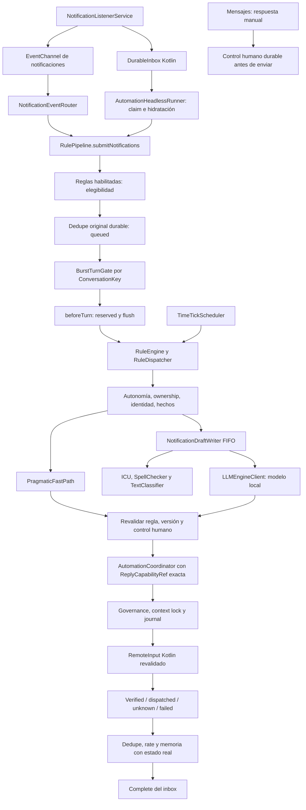

# Auditoría y correcciones de automatización / mensajería

> Continuación 2026-09-08: ver [Personalization Studio y actualización móvil](PERSONALIZATION-STUDIO.md). El APK, su hash y el estado de instalación citados abajo corresponden al snapshot anterior; el registro de la actualización está en `mobile-release-2026-09-08.json`.

Fecha del snapshot: 2026-09-07, America/Bogota. Fuente principal: worktree local, incluidos cambios previos. No se crearon ni ejecutaron tests automáticos durante esta auditoría. No se hizo commit, push, reinstall ni limpieza de bases de datos. La revisión estructural abarca 228 archivos Dart del módulo y 50 Kotlin de la aplicación; el examen funcional detallado se concentró en ingreso, persistencia, ejecución, lenguaje, ownership y ciclo de vida. El inventario no constituye prueba exhaustiva de todas las funciones.

## 1. Snapshot

HEAD local: `77ea20640b01e4b4aac2aa6b2ac5408356c02478`. `origin/master` consultado con `git ls-remote` coincide. Se conservaron `worktree-status-before.txt`, `worktree-stat-before.txt`, `worktree-before.patch`, inventario y hashes. Los cambios previos de Claude/otras iteraciones están en ese snapshot; no se atribuyen todos a esta auditoría.

Dispositivos observados: Samsung SM-A307G / Android 11 API 30 / serial R58N21SVSPE; Oppo CPH2557 / Android 15 API 35 / serial VGL7MVFMDYQG8T55. La conexión Samsung por IP es el mismo teléfono. Ambos tenían `dev.nanoai.mobile` 1.0.0, versionCode 1; los dumps completos quedan en `device-*.txt`. Los logs del Oppo registran `ensureReady fase=ready` con `qwen2.5-1.5b-instruct-q8_0-v2.gguf`; son evidencia del APK instalado anterior, no del APK compilado ahora. Modelo configurado y modelo efectivamente cargado no pudieron verificarse de forma independiente: `run-as` fue rechazado porque la app no es debuggable. No se alteró esa protección.

APK final: [app-release.apk](C:/Users/emman/Desktop/Proyectos/Nueva carpeta/Nanoai/products/nanoMOBILE/flutter_app/build/app/outputs/flutter-apk/app-release.apk); SHA-256 `8604f3a3cb2b52cec9f50869af81a9fc6b48f4603b72da192641430232465a6e`. No instalado por esta auditoría. Gradle informa firma con debug keystore: no es un artefacto firmado para distribución de producción.

## 2. Architecture map

No se añadió otro agente ni otro planner. El camino automático sigue en el coordinator existente; se eliminó la selección ambigua por nombre para el reply originado en una notificación. El grafo MCP no devolvió nodos Dart suficientes para este módulo; se recurrió a lecturas y referencias locales. `graphify update .` se ejecutó según AGENTS.md.

## 3. Flutter module inventory

Ver [inventario Dart](inventory-dart.md) y `inventory-final.json`: 228 archivos, declaraciones, imports, tamaño y SHA-256. Application conecta providers/coordinator; scheduling admite eventos y aplica reglas; messaging mantiene identidad/memoria/capacidad; notifications redacta/interpreta; personal_agent decide estilo, autonomía y ownership; execution/governance/trust concentran efectos. Planning, perception, navigation, skills, voice y orchestration atienden automatización general; sus declaraciones se inventariaron sin afirmar validación física completa.

## 4. Kotlin inventory

Ver [inventario Kotlin](inventory-kt.md): 50 archivos, incluidos MainActivity, NanoApplication, RuntimeScope, NativeRuntimeSupervisor, EngineSupervisor, NanoshellWorkerService, WorkerClient, RuntimeHeartbeat, NotificationAutomationService, AutomationRuntimeService, DurableInbox, AutomationStoreDb y handlers. Accessibility, OCR, intents, permisos, Shizuku, almacenamiento, voz, escritorio y terminal son superficies adicionales, no motores independientes de respuestas.

## 5. Flutter↔Kotlin contracts

`channels.json` contiene las referencias halladas. `com.nanoai/notifications`: list/status/reply y nuevo `completeEvent(package,key,postTime)`. Los mapas de mensajes llevan timestamps, sender, Person key/URI, isSelf y ahora isTruncated. Reply transmite key/actionIndex/remoteInputKey/contextFingerprint; Kotlin revalida contra la notificación activa. El canal de automation store propaga error explícito; sus operaciones se ejecutan en cola serial de fondo. Headless registra también language_assist y cierra su handler. No se cambió el esquema SQL ni se agregó un segundo almacén.

## 6. Notification ingress

[NotificationAutomationService.kt:52](C:/Users/emman/Desktop/Proyectos/Nueva carpeta/Nanoai/products/nanoMOBILE/flutter_app/android/app/src/main/kotlin/dev/nanoai/mobile/services/NotificationAutomationService.kt:52) y [notification_event_router.dart:30](C:/Users/emman/Desktop/Proyectos/Nueva carpeta/Nanoai/products/nanoMOBILE/flutter_app/lib/features/automation/engine/scheduling/notification_event_router.dart:30). Los eventos se insertan en el inbox antes del envío al sink vivo; antes, tener sink provocaba return sin persistencia. El router admite la lista MessagingStyle como tanda, espera su finalización y el gate antes de completar la fila nativa. La ruta headless usa el mismo `submitNotifications`. Una excepción conserva el evento nativo para recuperación.

## 7. Eligibility

[rule_pipeline.dart:129](C:/Users/emman/Desktop/Proyectos/Nueva carpeta/Nanoai/products/nanoMOBILE/flutter_app/lib/features/automation/engine/scheduling/rule_pipeline.dart:129). La elegibilidad por regla/paquete corre antes de Burst, memoria y LLM. Sin regla aplicable, SystemUI, clima o YouTube no abren turnos. Los resúmenes y mensajes marcados isSelf en MessagingStyle se excluyen. Queda un fallback localizado `Tú` para notificaciones legacy de WhatsApp; no es la única señal. No se transformó el listener en una whitelist exclusiva de WhatsApp.

## 8. Dedupe

[event_dedupe_store.dart:56](C:/Users/emman/Desktop/Proyectos/Nueva carpeta/Nanoai/products/nanoMOBILE/flutter_app/lib/features/automation/engine/scheduling/event_dedupe_store.dart:56). Los IDs se calculan por evento original, no por texto agregado. `queued` representa admisión sin ejecución; al reconstruir el store se libera para replay. `reserved` protege ejecución iniciada; dispatched/verified/unknown no se reintentan a ciegas. Carga SQLite y migración fallan cerradas; flush rechazado impide enviar. Ya no se expulsan eventos vivos por presión del cap: se difiere la admisión. Límite actual 800 eventos con TTL 24 horas; es una restricción operativa real, no almacenamiento ilimitado.

## 9. Durable inbox

Una sola DurableInbox SQLite nativa. RECEIVED → RESERVED → complete. Claim en transacción, rehidratación por notification key, recuperación de claims envejecidos. Se conserva la limitación histórica: se persiste identidad, no contenido; si Android ya retiró la notificación no puede reconstruirse el texto. El nuevo ACK vivo no acredita entrega al destinatario: solo procesamiento local terminado. La tabla nativa no tiene una política de retención/capacidad integral; no se borraron filas históricas para ocultarlo.

## 10. Burst

[burst_turn_gate.dart:73](C:/Users/emman/Desktop/Proyectos/Nueva carpeta/Nanoai/products/nanoMOBILE/flutter_app/lib/features/automation/engine/scheduling/burst_turn_gate.dart:73). Settle 800 ms, máximo de espera 3000 ms, conservación de 10/20 fragmentos sin disparo por conteo o tamaño. Orden por timestamp y posición estable en empates. Un turno en vuelo por conversación; lo que llega después forma el siguiente. Límites explícitos: 64 fragmentos en cola por conversación, 64 conversaciones, 800 fragmentos pendientes globales 64 admisiones pendientes y 64 tandas activas en el router. Overflow produce error/defer, no envío parcial. Dispose cancela timers y resuelve miembros pendientes. Error después de comenzar ejecución se clasifica unknown para evitar reenvío inseguro.

## 11. Supersede

La versión se captura antes de esperar redacción y se verifica después y antes del efecto. La cancelación contextual llega al dispatcher de herramientas, incluida la espera del journal. Versiones monotónicas globales evitan reutilización al retirar claves; mapa limitado a 800, invalidado al destruir provider. Evicción invalida conservadoramente un draft; no lo vuelve vigente.

## 12. Multi-contact

[conversation_key.dart:125](C:/Users/emman/Desktop/Proyectos/Nueva carpeta/Nanoai/products/nanoMOBILE/flutter_app/lib/features/automation/engine/messaging/conversation_key.dart:125). Paquete y cuenta forman parte de la identidad; WhatsApp y Business quedan separados. Locus/shortcut conservan claves estables. En grupos, Person.key del participante no se toma como identidad del grupo. Fallback débil incorpora notification key; sin evidencia el ID es vacío. El umbral de escritura sigue siendo 0.95: títulos y homónimos no autorizan auto-reply. Esto puede bloquear apps que no exponen identidad suficiente.

## 13. LLM scheduling

El writer de mensajería tiene FIFO compartido en el isolate, profundidad 64 y dedupe de trabajos por evento. El gate impide concurrencia por chat. [llm_engine_client.dart:148](C:/Users/emman/Desktop/Proyectos/Nueva carpeta/Nanoai/products/nanoMOBILE/flutter_app/lib/core/services/llm_engine_client.dart:148) eliminó el bucle de tres intentos físicos y la reutilización del request_id entre intentos. No se añadió un scheduler paralelo. No se demuestra con esta auditoría fairness global entre todas las superficies de chat, voz y automatización; esa carga simultánea exige observación física.

## 14. Conversation understanding

Se reutilizan ConversationUnderstanding, las señales de dominio y el motor de decisión. Correcciones y negaciones pertenecen al turno completo; el prompt mantiene el orden temporal. [pragmatic_fast_path.dart:68](C:/Users/emman/Desktop/Proyectos/Nueva carpeta/Nanoai/products/nanoMOBILE/flutter_app/lib/features/automation/engine/language/pragmatic_fast_path.dart:68) limita el saludo rápido a saludo puro y excluye live state antes de esa rama. Sí/no y referentes ambiguos se dejan al entendimiento contextual. La calidad semántica de los 35 casos permanece pendiente del modelo físico, no se infiere de compilar.

## 15. Android language resources

[LanguageAssistChannelHandler.kt:71](C:/Users/emman/Desktop/Proyectos/Nueva carpeta/Nanoai/products/nanoMOBILE/flutter_app/android/app/src/main/kotlin/dev/nanoai/mobile/channels/LanguageAssistChannelHandler.kt:71). ICU normaliza/segmenta; SpellChecker devuelve sugerencias; TextClassifier aporta hints. Las esperas get del clasificador ya no bloquean main: FutureTask con resultado asíncrono, plazo de 1200 ms, cola de 8 y fallback. SpellChecker tiene una solicitud pendiente, cookie por solicitud, rechazo busy, timeout 600 ms y cierre de sesión expirada; se eliminó la creación de sesiones sobrantes. Headless dispone del mismo handler. Ausencia de recursos del OEM degrada a señal ausente, no a éxito fabricado.

## 16. Persona

[persona_context.dart:79](C:/Users/emman/Desktop/Proyectos/Nueva carpeta/Nanoai/products/nanoMOBILE/flutter_app/lib/features/automation/personal_agent/application/persona_context.dart:79). Los ejemplos se describen como históricos y solo de estilo; se retiró la instrucción que los convertía en referencia de contenido. Preguntas de estado actual excluyen notas y ejemplos. Se retiró el log del cuerpo de ejemplos. El retriever y PersonaValidator existentes mantienen límites, origen y neutralización de datos.

## 17. Relationship/style

RelationshipRegister deriva trato desde perfil declarado. No se añadió intimidad por slang entrante. Limitación: los perfiles heredados se consultan por nombre normalizado del remitente; no existe migración completa de todas las relaciones a claves estables de conversación. M32 debe incluir homónimos. No se afirma aislamiento perfecto del registro de estilo heredado.

## 18. Context firewall

InstructionTrust, IntentFirewall y gobernanza permanecen en el camino de herramientas. El reply automático entra con capacidad factual y texto separado en AutomationOptions ([automation_goal.dart:75](C:/Users/emman/Desktop/Proyectos/Nueva carpeta/Nanoai/products/nanoMOBILE/flutter_app/lib/features/automation/domain/automation_goal.dart:75)), sin permitir al LLM elegir destinatario. Los textos de notificación y ejemplos no conceden autoridad. La revisión de source no equivale a una garantía de inmunidad semántica del modelo ante cualquier prompt injection.

## 19. Live state

No se encontró una fuente viva verificable de ubicación/actividad actual del dueño. La respuesta debe reconocer ausencia de información o quedar retenida; no completar con notas históricas. La detección actual es determinista y acotada, no comprensión universal de toda paráfrasis. M04/M23 siguen siendo criterios de aceptación físicos.

## 20. Business facts

BusinessFacts, FactSelector y memoria de turno existentes separan catálogo del contexto personal. No se añadieron precios, stock, pedidos, reservas ni integraciones inventadas. Falta de stock/precio sigue siendo falta de evidencia. WhatsApp Business requiere regla configurada para su paquete; soporte de transporte no significa autorización automática para todos los paquetes.

## 21. Ownership

[conversation_ownership_store.dart:20](C:/Users/emman/Desktop/Proyectos/Nueva carpeta/Nanoai/products/nanoMOBILE/flutter_app/lib/features/automation/personal_agent/application/conversation_ownership_store.dart:20). Control humano inmediato en memoria y durable antes del envío manual. Liberar al bot requiere persistencia satisfactoria; fallo conserva bloqueo humano. Escrituras seriales y revisiones por conversación impiden que una respuesta de escritura antigua revierta la elección nueva. La UI espera load/persist y comunica error. La detección universal de respuestas manuales escritas directamente en otras apps aún depende de lo que publique cada app: no se promete reconocer toda intervención externa.

## 22. Autonomy defaults

Se conservan safeAuto inicial y disabled para valor inválido. Replies fijos y dinámicos pasan ownership/autonomía/identidad y revalidan justo antes del efecto. Sugerencias no envía automáticamente. Se corrigió su descripción: la superficie disponible es generar/revisar en Mensajes; no se anuncia una cola de aprobaciones automáticas que hoy no existe.

## 23. Rules

[rule_registry.dart:91](C:/Users/emman/Desktop/Proyectos/Nueva carpeta/Nanoai/products/nanoMOBILE/flutter_app/lib/features/automation/engine/scheduling/rule_registry.dart:91). Carga única; error al leer reglas no se convierte en lista vacía que resiembre auto-reply habilitado. Escrituras seriales, flush antes de admisión y bloqueo de persistencia fallida. Cambios de regla durante un draft se comprueban otra vez. La regla universal existente se conserva por compatibilidad. TimeTickScheduler espera callbacks, registra errores e impide ejecuciones solapadas; sigue siendo Timer con proceso vivo, no alarma durable de Android.

## 24. Dispatcher

[rule_dispatcher.dart:242](C:/Users/emman/Desktop/Proyectos/Nueva carpeta/Nanoai/products/nanoMOBILE/flutter_app/lib/features/automation/engine/scheduling/rule_dispatcher.dart:242) y [automation_coordinator.dart:1](C:/Users/emman/Desktop/Proyectos/Nueva carpeta/Nanoai/products/nanoMOBILE/flutter_app/lib/features/automation/application/automation_coordinator.dart:1). ReplyCapabilityRef viaja desde el evento al ToolCall exacto. Regla/acción/texto/dynamicReply, autonomía, ownership, truncamiento y versión deben seguir vigentes al ejecutar. Sigue una respuesta dueña por evento aunque coincidan varias reglas. Las herramientas continúan en coordinator → governance → journal → native executor.

## 25. RemoteInput

Se exigen key, acción, remoteInputKey y fingerprint factual. Kotlin recompone contexto activo antes de send. Si cambió o expiró, se falla sin seleccionar otro chat por nombre. RemoteInput aceptado significa dispatched unverified, nunca prueba de recepción remota. No se agregó fallback de UI para salvar una capacidad expirada.

## 26. Verification

Outcomes separados: verified, dispatched unverified, unknown, failed, ignored. Error de rate persist posterior al envío conserva el resultado real y la evidencia de dedupe. Una excepción de turno después de entrar a ejecución no se convierte en fallo pre-efecto reintentable. La comprobación de lectura/doble check/recepción por WhatsApp no está disponible mediante RemoteInput.

## 27. Rate limiting

[contact_rate_limiter.dart:176](C:/Users/emman/Desktop/Proyectos/Nueva carpeta/Nanoai/products/nanoMOBILE/flutter_app/lib/features/automation/engine/scheduling/contact_rate_limiter.dart:176). Límite existente 3 intentos con efecto por conversación en 10 minutos. SQLite ilegible o migración fallida bloquean consultas; fallo de escritura se propaga, con tratamiento especial posterior al envío para no borrar su resultado. Es una política de seguridad real que puede detener una conversación larga: no se eliminó para aparentar continuidad ilimitada.

## 28. Timeouts

LLM: 240 s por generación y cancelación correlacionada en timeout/error de conexión. Android language: 600/1200 ms. Lecturas críticas SQLite y ACK: 10 s. Headless: watchdog 120 s renovado por heartbeat Dart cada 30 s. `timers-retries.json` inventaría referencias; los valores no son mediciones de latencia del APK nuevo.

## 29. Retries

El único retry semántico de este camino es `generateWithColdRetry`: primera salida vacía en menos de 3 s; excepciones y generaciones largas vacías no lo activan. No reintento ciego tras timeout ni unknown. Dedupe failed previo al efecto tiene backoff 30 s. La capacidad saturada se difiere; no se garantiza drenado inmediato sin nuevo wake/replay.

## 30. Zombies

Cancelación LLM por request_id incluso en el último timeout. Gate dispose y guard invalidation, router generation, callbacks de lenguaje acotados y cierre de executor. UI adquiere RuntimeScope antes de retirar headless durante configureFlutterEngine, evitando la ventana con cero holders. La transición se ejecuta síncrona si ya está en main. No se afirma haber demostrado ausencia de zombies en ciclos prolongados físicos.

## 31. Streams/listeners

El router evita doble start; stop cancela la suscripción e invalida replay frío. EventChannel tiene dueño nativo y clearSink solo lo libera si coincide. El gate drena trabajo previo al ACK. Se mantiene cancelación y cierre desde providers. Matriz M27 pendiente para múltiples aperturas/cierres reales.

## 32. Headless

[AutomationRuntimeService.kt:311](C:/Users/emman/Desktop/Proyectos/Nueva carpeta/Nanoai/products/nanoMOBILE/flutter_app/android/app/src/main/kotlin/dev/nanoai/mobile/automation/AutomationRuntimeService.kt:311). Un engine de automatización con claim de inbox, mismos stores/pipeline/gate, heartbeat mientras el modelo procesa y cierre de language handler. La UI retira el engine anterior antes de hidratar el nuevo. FGS dataSync depende de permisos/políticas OEM y restricciones de Android; un wake bloqueado no es respuesta enviada. No se cambió configuración de batería ni permisos de teléfonos.

## 33. SQLite

AutomationStoreDb mantiene secciones y datos personales; DurableInbox mantiene IDs de eventos. Se corrigió fail-open en stores críticos y se movió el puente de secciones fuera de main. No hubo migración destructiva. Las secciones siguen siendo snapshots JSON: no se realizó una conversión completa a transacciones por fila ni un protocolo de versionado entre isolates. La reducción del solapamiento UI/headless mejora ese riesgo, pero las carreras físicas de handoff deben validarse.

## 34. Dead components

`unreferenced-import-candidates.json` contiene ocho candidatos sin import/export directo desde lib. No prueba código muerto: pueden ser entrypoints, plugins o utilidades. `placeholder-candidates.json` recoge marcadores para revisión. No se eliminó código por búsqueda textual ni se presentó una interfaz/abstracción como implementación falsa sin evidencia. No se certifica cierre funcional de cada capacidad general inventariada.

## 35. Duplicated components

Producción y memoria/shared_preferences de dedupe/rate comparten contratos; no se borraron implementaciones auxiliares. Un solo camino de admisión para vivo/frío/headless, un solo coordinator y una sola DurableInbox. Se removieron cargas adelantadas duplicadas de providers críticos. Los planners generales existentes siguen disponibles para otros objetivos; no se reescribieron por tamaño.

## 36. Bottlenecks

Hallazgos corregidos: colas Dart sin límite, main bloqueado por classifier/SQLite, reintentos LLM acumulados, sesiones de corrector sobrantes. Pendientes medibles: snapshots JSON completos, SQLite inbox sobre callback nativo, retención del inbox, espera de modelo en hardware lento y contención con otras funciones. Archivos mayores: dispatcher 2522 líneas, task_orchestrator 2362, settings 1541, coordinator 1401. El tamaño por sí solo no justificó una extracción arriesgada durante esta corrección.

## 37. Bugs fixed

Cada fila identifica mecanismo observado, corrección y riesgo residual. Evidencia anterior: `worktree-before.patch` y snapshot; evidencia final: enlaces a source de las secciones anteriores.

| ID / severidad | Causa / fallo | Corrección | Riesgo / caso manual |
|---|---|---|---|
| A01 P0 | Reply seleccionado por nombre visible al convertir evento en goal | Capacidad exacta hasta ToolCall | Identidad insuficiente bloquea; M13/M20/M21 |
| A02 P0 | Control humano activado después del envío manual y fire-and-forget | Ownership durable antes de enviar y revalidación | Intervención fuera de Nano depende de OEM; M22 |
| A03 P0 | Error SQLite de dedupe/ownership interpretado como instalación vacía | requiredSection y fallo cerrado | Almacén corrupto exige reparación explícita; M18/M25 |
| A04 P1 | Regla/autonomía podían cambiar durante draft sin nueva comprobación | Callback vigente antes del efecto | Tras Native send no hay undo; M28/M29 |
| A05 P1 | Replay con sink vivo carecía de inbox durable | Insert antes de emitir + ACK explícito | Contenido retirado no recuperable; M18/M26 |
| A06 P1 | queued y ejecución indistinguibles tras process death | Estado queued recuperable, reserved antes de turno | Ejecución incierta se retiene; M18 |
| A07 P1 | Colas/timers/guard sin límite o dispose | Límites explícitos, cancelación de timers, versiones únicas | Overflow difiere, no rendimiento ilimitado; M11/M14/M35 |
| A08 P0 | Cap de dedupe expulsaba evidencia válida | Rechazar nuevos eventos al saturarse | Tope 800/24 h; M18/M35 |
| A09 P1 | Tres reintentos LLM y último timeout huérfano | Una solicitud y cancel correlacionado | Modelo frío puede fallar honestamente; M25/M34 |
| A10 P1 | Future.get classifier bloqueaba main | FutureTask asíncrono, cola 8, timeout | OEM puede no aportar hints; M14/M35 |
| A11 P1 | Sesiones extra y resultados spell cruzados | Reutilización, busy, cookie y cierre en timeout | Corrector ausente degrada; M02/M33 |
| A12 P1 | Persona histórica era instrucción de contenido actual | Estilo histórico y exclusión en live state | Detector semántico acotado; M04/M23 |
| A13 P1 | Grupo identificado por participante; ID vacío aparentaba válido | Group-aware key e ID vacío real | App sin locus/shortcut puede quedar bloqueada; M20 |
| A14 P1 | Saludo flexible ocultaba contenido adicional | Fast path de saludo puro con exclusión live state | Más turnos ambiguos usan LLM; M01/M04/M09 |
| A15 P1 | Excepción posterior al efecto convertida en failed reintentable | Preservar outcome; unknown si ejecución iniciada | Más casos requieren revisión manual; M18/M34 |
| A16 P1 | UI adquiría runtime después de configurar engine | Acquire UI + retiro headless antes de bootstrap | Validar repetición física; M27 |
| A17 P1 | Regla corrupta retornaba vacío y auto-seed habilitado | Carga fallida no siembra; persistencia serial | Configuración corrupta detiene auto; M28 |
| A18 P1 | Texto truncado parecía completo y salida se cortaba a 2000 | Flag nativo de truncamiento y rechazo de output largo | Solicitud grande puede retenerse; M30 |
| A19 P2 | Tick async ignorado y posible solapamiento | Await, guard y manejo de errores | No dispara con proceso muerto; M26 |
| A20 P2 | UI prometía aprobación automática inexistente | Descripción ajustada al flujo manual disponible | Cola de aprobación no implementada; M29 |

## 38. Files modified

`audit-dart-files.json` enumera los 24 archivos Dart trabajados en esta auditoría. Kotlin: MainActivity.kt, AutomationRuntimeService.kt, NotificationAutomationService.kt, NotificationAutomationChannelHandler.kt, AutomationStoreChannelHandler.kt y LanguageAssistChannelHandler.kt. Los cambios anteriores adicionales permanecen en el worktree. `worktree-status-final.txt` y `worktree-stat-final.txt` registran todo el estado, sin atribuir a esta auditoría lo que ya estaba modificado.

## 39. Static validation

`flutter analyze lib/ --no-pub`: cero errores y cero warnings; 17 infos de estilo preexistentes en Chat/Models, fuera del módulo. El comando devuelve 1 por esas infos; no se presenta como salida 0. `flutter build apk --release --target-platform android-arm64 --no-pub`: exitoso. Kotlin se compiló dentro del build; la invocación explícita `:app:compileReleaseKotlin` terminó BUILD SUCCESSFUL, registrada en `automation-kotlin-output.log`. El análisis específico `flutter analyze lib/features/automation/ --no-pub` terminó con salida 0 y No issues found; log `automation-module-analyze-output.log`. Los logs finales se copian a este directorio.

Gradle advierte firma debug de desarrollo. Flutter advierte fuente CupertinoIcons no incluida; no se localizaron usos de CupertinoIcons en automatización. No se tocaron esas otras pantallas ni se ejecutaron tests para ocultar el alcance. `graphify update .` terminó y registró advertencias de archivos sin nodos y visualización demasiado grande; el código compilado no depende de esa visualización.

## 40. Manual physical checklist

[Casos M01–M35](MANUAL-M01-M35.md), con entrada, observación esperada y campos de evidencia. Todos pendientes de tu ejecución manual con este APK. No se usaron logs antiguos como prueba de que una corrección nueva funcionó.

## 41. Remaining limitations

- No hay firma de distribución configurada; no se instaló ni probó físicamente este APK.
- Inbox de identidad no recupera contenido que Android retiró; su retención global no está completada.
- No hay reconocimiento universal garantizado de toma de control escrita directamente desde cualquier app externa.
- Relaciones heredadas basadas en nombre pueden compartir registro de estilo entre homónimos; no se completó su migración a identidad estable.
- Temporizadores de hora dependen de proceso vivo; no son AlarmManager. Recursos de idioma y FGS dependen de Android/OEM.
- Tope conservador de dedupe 800/24 h y rate 3/10 min pueden detener tráfico alto. Fairness entre chat/voz/automatización y sesiones prolongadas no se ha medido.
- No hay fuente viva del estado del dueño ni entrega remota verificable por RemoteInput. Identidad débil bloquea auto-reply.
- La revisión estructural de todas las declaraciones no cierra por sí sola capacidades generales sin prueba física o integración real.

## 42. Final verdict

**NOT READY** para declarar todo el módulo, todas sus capacidades y distribución de producción terminados. Hay un APK compilado con correcciones concretas y preparado para revisión manual, pero las limitaciones anteriores y M01–M35 pendientes impiden la afirmación “completo sin errores”. No se declara ready solo por compilar.
