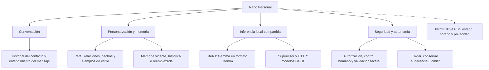
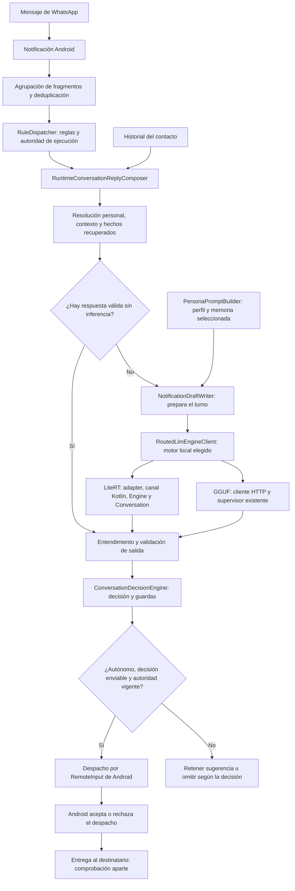

# Nano Personal: arquitectura y mapa conceptual

Revisión: 1 de octubre de 2026. Alcance: agente personal móvil e inferencia local.
Este documento describe código existente y evidencia manual; no certifica el producto al 100%.
No representa la mensajería personal por notificaciones como Meta WhatsApp Cloud API.

## Mapa conceptual

## Recorrido real de una respuesta autónoma

La selección local es por formato; el diagrama no promete un fallback automático
entre modelos cuando uno falla. La configuración comercial y los proveedores externos
quedan fuera del recorrido local comprobado aquí.

## Correspondencia con el código

Rutas relativas a `products/nanoMOBILE/flutter_app/`.

| Responsabilidad | Archivo existente |
| --- | --- |
| Reglas y envío condicionado | `lib/features/automation/engine/scheduling/rule_dispatcher.dart` |
| Compositor canónico | `lib/features/automation/engine/conversation/conversation_reply_composer.dart` y sus partes |
| Preparación del borrador | `lib/features/automation/engine/notifications/notification_draft_writer.dart` y sus partes |
| Memoria factual personal | `lib/features/automation/personal_agent/application/personal_memory_fact_resolver.dart` |
| Contexto de persona | `lib/features/automation/personal_agent/application/persona_prompt_builder_body.part.dart` |
| Selección y vigencia de recuerdos | `lib/features/automation/personal_agent/application/persona_prompt_builder_helpers.part.dart` |
| Decisión de autonomía | `lib/features/automation/personal_agent/application/conversation_decision_engine.dart` y sus partes |
| Clasificación de afirmaciones | `lib/features/automation/personal_agent/application/conversation_decision_guards.dart` |
| Propietario de motores locales | `lib/core/services/runtime_engine.dart` y sus partes |
| Transporte local seleccionado | `lib/core/services/routed_llm_engine_client.dart` |
| Adaptador y stream LiteRT | `lib/core/services/litert_inference_adapter.dart`, `litert_stream_lifecycle.dart` |
| Carga, generación y cierre JNI | `android/app/src/main/kotlin/dev/nanoai/mobile/channels/LiteRtChannelHandler.kt`, `LiteRtEngineOwner.kt`, `LiteRtGeneration.kt` |
| Comparación con métricas reales | `lib/core/services/inference_benchmark_runner.dart` |

## Ciclo de vida y correcciones incluidas

- Chat y Personal comparten el propietario del motor local; no hay un segundo agente nuevo.
- Los cambios de modelo se serializan; al seleccionar LiteRT se detiene GGUF y se pausa su watchdog HTTP.
- LiteRT carga, genera, cancela y libera JNI fuera del hilo visual.
- Cancelar y cerrar la conversación JNI se protegen de concurrencia; el ID evita cancelar un turno posterior.
- El timeout de inferencia es total por solicitud; los latidos no simulan texto generado.
- El benchmark no inventa velocidades ni cantidades de tokens cuando faltan métricas.
- El catálogo incluye la variante Gemma-4-E2B-it y selecciona variantes exactas.
- SHA-256 de modelos grandes se calcula fuera del hilo principal.
- Se corrigió el falso positivo que trataba «No estoy seguro» como actividad afirmada del dueño.
- Sin hechos recuperados, el resolver factual permite continuar hacia el modelo en vez de inventar agenda.

## Evidencia manual y límites

- APK `fullSideload debug`: compilada e instalada conservando datos, reglas y modelos.
- A las 21:29 se recuperó un mensaje pendiente autorizado; no fue un mensaje nuevo posterior a instalar.
- Una llamada semántica, un turno lógico y `draftsSent=1`; no se pulsó Sugerir ni Enviar.
- Gemma GPU: 21.589 ms de generación, 12.190 ms al primer token, 58 tokens y 5,40 tokens/s de decode.
- Android devolvió `REMOTE_INPUT_ACCEPTED` y `replyDispatchedUnverified`.
- El usuario confirmó posteriormente que funcionó y recibió la respuesta.
  Esa confirmación manual no cambia el nivel de verificación del registro de Android.
- Análisis acotado de 30 archivos Dart: sin incidencias. No se ejecutaron tests automatizados.
- Los 35 archivos de código incluidos en esta actualización tienen menos de 200 líneas.

Pendientes: continuidad entre turnos, párrafos con varias preguntas, velocidad sostenida,
ráfagas de mensajes, segundo plano y estabilidad con varios contactos autorizados.
El ANR anterior tuvo el hilo principal en `ImageReader/FlutterImageView/onEndFrame`;
la corrección de cancelación JNI no prueba resuelto ese bloqueo visual.
La ventana nativa personal de cuatro turnos, hasta 280 caracteres por entrada,
no equivale a memoria conversacional ilimitada.

## Mi estado: propuesta, todavía no integrada

La base `PersonalMemory` distingue memoria temporal y caducidad. Sin embargo:

- El formulario actual de notas manuales guarda `stablePreference`, sin un horario de vigencia editable.
- `PersonaPromptBuilder` excluye notas y recuerdos en preguntas detectadas como estado actual.
- Tener una nota persistida no demuestra que el modelo y las guardas la utilicen como evidencia vigente.

Una implementación futura debe reutilizar esa base, distinguir estado actual de plan o rutina,
permitir editar y caducar el estado, respetar su privacidad y conectar la evidencia vigente
al compositor y a la decisión de envío. No se implementó esta propuesta en este commit.

Los registros, el informe completo del teléfono y las capturas permanecen locales;
no se incluyen conversaciones privadas, APKs ni pesos de modelos en esta publicación.
