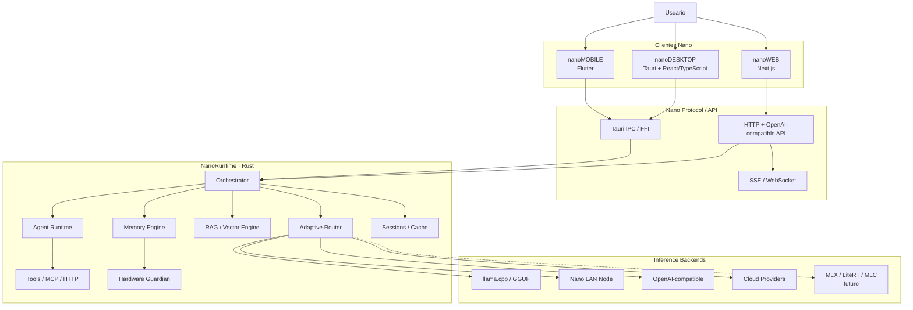
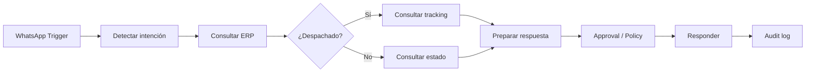
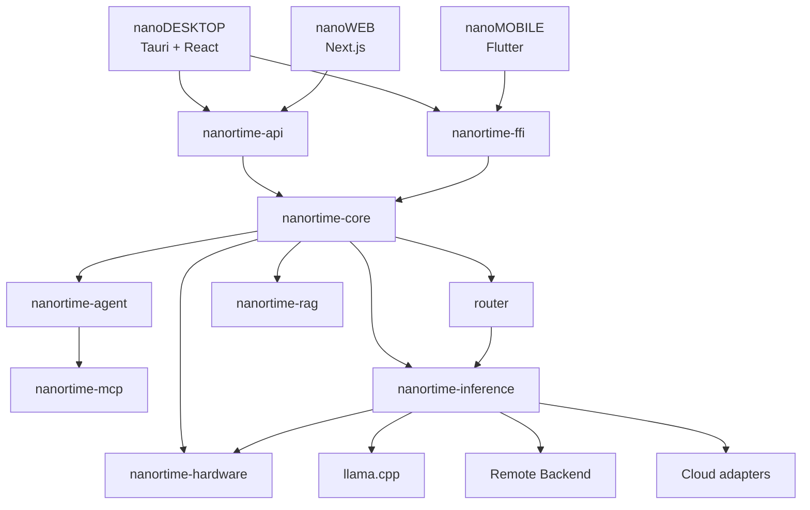
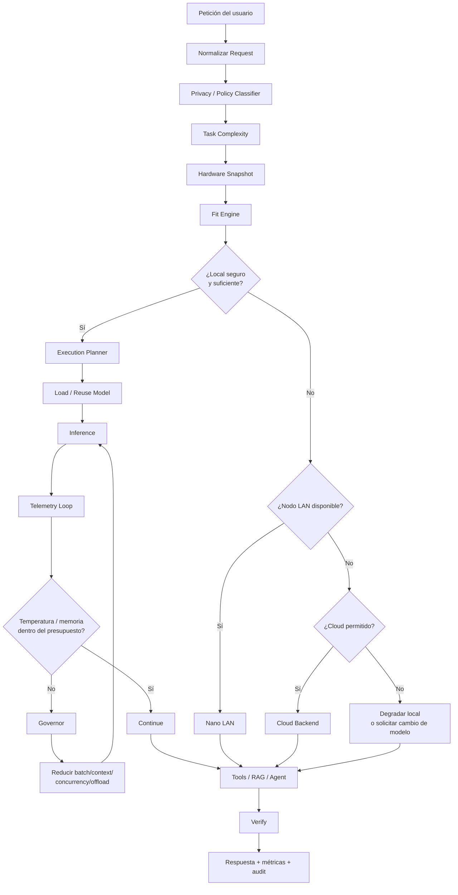
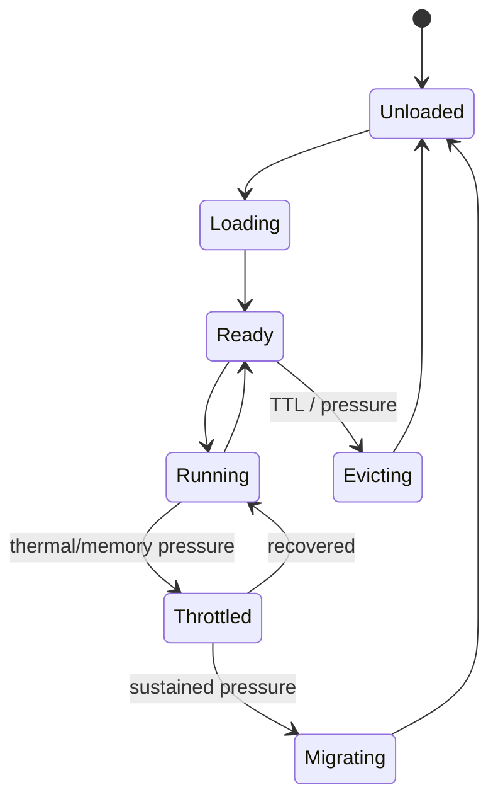
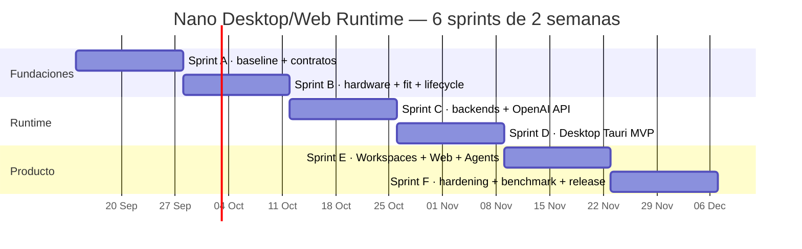

# Ingeniería comparativa e integración de Jan, llama.cpp, LocalAI, Open WebUI, AnythingLLM, Dify, Sim, LM Studio y GPT4All en NanoRuntime/NanoMOBILE

## Resumen ejecutivo

La conclusión principal es que **Nano no debería convertirse en un fork de ninguno de estos proyectos**. La estrategia técnicamente más sólida es mantener `NanoRuntime` como núcleo Rust independiente y extraer de los proyectos analizados **patrones, contratos, pruebas, algoritmos de lifecycle y UX**, reutilizando código únicamente cuando la licencia y la compatibilidad técnica lo hagan razonable. El objetivo final debe ser que Mobile, Desktop y Web sean clientes distintos de un mismo runtime y protocolo. [NanoRuntime](https://github.com/emmahiguita/NanoRuntime) [Jan](https://github.com/janhq/jan) [llama.cpp](https://github.com/ggml-org/llama.cpp) [LocalAI](https://github.com/mudler/LocalAI)

La priorización que recomiendo es:

| Prioridad | Proyecto | Qué aprender/adaptar a Nano | Reutilización recomendada |
|---|---|---|---|
| **P0** | **llama.cpp** | GGUF, loading, CPU/GPU offload, KV cache, model-fit, server, benchmarks | Integración directa como backend |
| **P0** | **Jan** | Desktop local, Tauri, hardware UX, model lifecycle, instalación | Patrones + componentes compatibles |
| **P0** | **LocalAI** | abstracción multi-backend, API OpenAI-compatible, routing | Arquitectura/contratos |
| **P0** | **Nano actual** | Memory Engine, routing, RAG, ToolExecutor, MCP, FFI | Conservar y refactorizar |
| **P1** | **AnythingLLM** | workspaces, RAG empresarial, documentos, knowledge | Patrones backend/UX |
| **P1** | **Open WebUI** | UX web, administración, tools, usuarios, connections | Estudiar; evitar clonación por licencia actual |
| **P1** | **GPT4All** | onboarding, LocalDocs, catálogo/model lifecycle simple | Patrones y testing |
| **P2** | **Dify** | workflows, agentes, observabilidad | Patrón de Automation Studio |
| **P2** | **Sim** | workflow canvas y construcción visual de agentes | Patrón de UX; revisar licencia del tag |
| **Referencia** | **LM Studio** | memory estimator, TTL, auto-evict, server UX | Análisis de comportamiento; no copiar app |

Esta priorización es importante porque **LM Studio no debe tratarse como un repositorio open-source equivalente a llama.cpp o Jan**: su aplicación principal es un producto distribuido por LM Studio y debemos limitarnos a sus interfaces y documentación pública. En cambio, llama.cpp publica su código bajo MIT; Jan publica código y arquitectura desktop; LocalAI también ofrece un backend abierto que resulta especialmente útil como referencia para desacoplar motores de inferencia. [llama.cpp LICENSE](https://github.com/ggml-org/llama.cpp/blob/master/LICENSE) [Jan LICENSE](https://github.com/janhq/jan/blob/dev/LICENSE) [LocalAI LICENSE](https://github.com/mudler/LocalAI/blob/master/LICENSE) [LM Studio Docs](https://lmstudio.ai/docs)

La arquitectura objetivo que propongo es ésta:



La diferencia estratégica sería considerable: **Jan/LM Studio son principalmente experiencias de IA local; AnythingLLM/Open WebUI cubren conocimiento y aplicaciones web; Dify/Sim cubren workflows; LocalAI abstrae motores. Nano puede unir local inference + hardware-aware execution + Android + PC/Linux + RAG + MCP + acciones verificables** alrededor de un único runtime. Esa combinación es más interesante que intentar ganar únicamente en tokens por segundo. [Jan](https://github.com/janhq/jan) [AnythingLLM](https://github.com/Mintplex-Labs/anything-llm) [Open WebUI](https://github.com/open-webui/open-webui) [Dify](https://github.com/langgenius/dify) [Sim](https://github.com/simstudioai/sim)

### Snapshot y política de commits

Por tratarse de repositorios muy activos —especialmente llama.cpp— **no recomiendo integrar contra `master`/`main` flotante**. Para cada dependencia se debe generar un `UPSTREAM.lock` que conserve `repository`, `tag`, `commit SHA`, licencia, fecha y patches Nano. El análisis de este informe corresponde al estado público observado alrededor del **14 de septiembre de 2026**; antes de introducir código upstream en producción debe fijarse el SHA exacto del tag elegido y volver a ejecutar el análisis de licencia.

Un ejemplo:

```toml
[[upstream]]
name = "llama.cpp"
repository = "ggml-org/llama.cpp"
tag = "<release-validado>"
commit = "<sha-fijado>"
license = "MIT"
purpose = "GGUF inference backend"

[[upstream]]
name = "jan"
repository = "janhq/jan"
tag = "<release-validado>"
commit = "<sha-fijado>"
license = "<license-del-tag>"
purpose = "desktop architecture reference"
```

No inventaría SHAs históricos que cambian diariamente. **El entregable del primer sprint debe fijar los commits después de pasar nuestra batería de compatibilidad**, en lugar de considerar “último commit” como sinónimo de “versión adecuada para Nano”.

## Análisis técnico de los proyectos

### llama.cpp: dependencia fundamental, no competidor

`ggml-org/llama.cpp` es la referencia de mayor prioridad porque Nano ya se orienta a GGUF y llama.cpp ofrece la capa inferior que no tiene sentido volver a implementar: carga de modelos, cuantización/formatos GGUF, inferencia, CPU/GPU offloading, KV cache, backends de aceleración, servidor y herramientas de benchmark. El proyecto está publicado bajo MIT. [Repositorio](https://github.com/ggml-org/llama.cpp) [LICENSE](https://github.com/ggml-org/llama.cpp/blob/master/LICENSE) [llama-server](https://github.com/ggml-org/llama.cpp/tree/master/tools/server)

Arquitectónicamente:

```text
GGUF
 ↓
ggml / llama.cpp
 ↓
model load
 ↓
context / KV
 ↓
CPU + GPU backend
 ↓
sampling / decode
 ↓
tokens
```

Para Nano no tomaría `llama-server` como proceso obligatorio. Mantendría **dos adapters**:

```text
LlamaNativeBackend
    Rust → FFI → llama.cpp

LlamaServerBackend
    Rust → HTTP → llama-server
```

El primero favorece Mobile y un desktop compacto. El segundo es extremadamente útil para pruebas A/B, aislamiento de procesos, validación de compatibilidad OpenAI y recuperación ante crashes.

GGUF debe seguir siendo el formato local principal de la primera generación de Nano Desktop. La documentación de llama.cpp describe GGUF como formato esperado para modelos y el proyecto distribuye herramientas relacionadas con conversiones y cuantización. [README](https://github.com/ggml-org/llama.cpp/blob/master/README.md)

Una función upstream especialmente relevante para Nano es **model fitting**. `llama-server` incluye parámetros `--fit`/`--fit-target` para ajustar la configuración a memoria de dispositivo disponible. Es exactamente el tipo de comportamiento que Nano debería utilizar como baseline, pero complementándolo con temperatura, RAM, batería y carga sostenida. [llama-server README](https://github.com/ggml-org/llama.cpp/blob/master/tools/server/README.md)

Ejemplo de laboratorio:

```bash
llama-server \
  -m ./models/model.gguf \
  --fit on \
  --fit-target 1024 \
  --host 127.0.0.1 \
  --port 8080
```

No congelaría el `1024` como regla universal de Nano. La reserva adecuada depende del sistema, compositor, GPU compartida y otras cargas. Nano debe calcularla dinámicamente.

**Integración Nano:**

| Nano | Cambio |
|---|---|
| `products/nanoRUNTIME/nanortime-core/` | Crear/reforzar trait `InferenceBackend` |
| módulo actual que carga GGUF | Encapsular directamente en `LlamaCppBackend` |
| Memory Engine | Alimentarlo con estimaciones reales de llama.cpp |
| `nanortime-web` | Añadir backend server como modo opcional de aislamiento |
| `nanortime-cli` | Exponer `nano benchmark` y `nano fit` |
| `nanortime-ffi` | Mantener boundary estable para Android |
| `nanoMOBILE` | No acceder directamente a llama.cpp desde UI |

La regla debería ser:

```rust
#[async_trait]
pub trait InferenceBackend: Send + Sync {
    async fn probe(&self) -> Result<BackendCapabilities>;
    async fn estimate(&self, request: FitRequest) -> Result<FitReport>;
    async fn load(&self, model: &ModelSpec, plan: &ExecutionPlan) -> Result<ModelHandle>;
    async fn generate(
        &self,
        request: GenerationRequest,
        sink: TokenSink,
    ) -> Result<GenerationMetrics>;
    async fn unload(&self, handle: &ModelHandle) -> Result<()>;
}
```

Eso evita que el resto de Nano conozca CUDA, Vulkan, Metal o `n_gpu_layers`.

### Jan: referencia principal para Nano Desktop

Jan es probablemente la mejor referencia estructural para la aplicación desktop porque combina frontend web con backend nativo y modelos locales. Su repositorio contiene una separación entre aplicación, backend desktop/core y extensiones; su stack y experiencia permiten estudiar exactamente las áreas que Nano necesita: bootstrap, lifecycle, configuración, model hub, hardware y packaging. [Jan repository](https://github.com/janhq/jan) [Jan Docs](https://jan.ai/docs)

No portaría su arquitectura entera. Extraería cinco patrones:

| Patrón | Adaptación Nano |
|---|---|
| Shell desktop nativo | `nanoDESKTOP/src-tauri` |
| Web UI desacoplada | React/TypeScript |
| Hardware/model status | Nano Hardware panel |
| Model management | Nano Model Registry |
| Extensibilidad | MCP/Skills, no un segundo sistema paralelo |

Nano debe conservar la lógica de inferencia en Rust, no moverla al frontend.

La experiencia debería ser aproximadamente:

```text
┌───────────────────────────────────────────────────────────────────┐
│  Nano     Buscar, conversar o ejecutar...     ● LOCAL · Balanced │
├────────────┬────────────────────────────────────┬─────────────────┤
│ Inicio     │ [Chat] [main.rs] [Terminal] [Git] │ AGENTE          │
│ Workspaces │                                    │                 │
│ Chat       │            WORKSPACE               │ Plan            │
│ Agentes    │                                    │ ✓ archivos      │
│ Modelos    │                                    │ ✓ tests         │
│ Knowledge  │                                    │ → verificar     │
│ Terminal   │                                    │                 │
│ MCP/Skills │                                    │ Hardware        │
│ Auto       │                                    │ GPU 66 °C       │
├────────────┴────────────────────────────────────┴─────────────────┤
│ 🦉 Seguro · Qwen local · 18.7 tok/s · 4.3 / 6 GB VRAM           │
└───────────────────────────────────────────────────────────────────┘
```

Jan es sobre todo fuente de **patrones de desktop**, no de componentes que debamos copiar masivamente. Diferentes stacks internos y la identidad de Nano hacen que una reimplementación limpia sobre Tauri sea preferible.

### LocalAI: referencia para desacoplar la inferencia

LocalAI debe estudiarse como patrón de **backend abstraction + API gateway**. Su valor para Nano no es el frontend: es demostrar cómo un servicio local puede presentar contratos compatibles con APIs conocidas mientras oculta diferentes backends. [LocalAI](https://github.com/mudler/LocalAI) [Docs](https://localai.io/) [LICENSE](https://github.com/mudler/LocalAI/blob/master/LICENSE)

Nano debería llegar a:

```text
Nano API
   │
   ├── /v1/models
   ├── /v1/chat/completions
   ├── /v1/embeddings
   └── Nano-native API
           │
           ▼
    InferenceBackend
      │     │     │
      │     │     └── Remote/OpenAI-compatible
      │     └──────── Nano LAN node
      └────────────── llama.cpp
```

La API OpenAI-compatible es particularmente importante porque inmediatamente permite conectar herramientas existentes sin construir SDK para cada una.

Pero no debemos limitar Nano a esa API. OpenAI-compatible será el **interoperability layer**. Funciones propias como hardware, agents, workflow, privacy y execution plan deben quedar bajo endpoints Nano:

```text
/api/runtime/*
/api/hardware/*
/api/agents/*
/api/tools/*
/api/mcp/*
/api/knowledge/*
/api/tasks/*
```

### Open WebUI: UX empresarial y administración

Open WebUI es una referencia muy fuerte para **web multiusuario, conocimiento, herramientas, conexiones y administración**, pero su licencia actual merece mucho más cuidado que proyectos MIT. Su repositorio publica los términos aplicables y estos deben revisarse para el tag concreto antes de copiar o modificar componentes, especialmente alrededor de branding y distribución. [Repositorio](https://github.com/open-webui/open-webui) [LICENSE](https://github.com/open-webui/open-webui/blob/main/LICENSE) [Docs](https://docs.openwebui.com/)

Yo utilizaría Open WebUI exclusivamente como referencia para:

```text
Knowledge
Users
Roles
Connections
Models
Tools
Admin
Chat UX
```

y desarrollaría una UI propia Nano.

Para Nano Web:

```text
Nano Enterprise
├── Workspaces
├── Knowledge
├── Agents
├── Automations
├── Models
├── MCP & Skills
├── Users
├── Roles
├── Audit
└── Runtime Nodes
```

Ese es un caso claro donde **ingeniería comparativa sí; clonación no**.

### AnythingLLM: RAG y workspaces

AnythingLLM es especialmente relevante para la capa empresarial porque sus conceptos de workspace, ingesta documental y conocimiento encapsulado son más cercanos a lo que Nano Private AI necesita que un chat general. [AnythingLLM](https://github.com/Mintplex-Labs/anything-llm) [Docs](https://docs.anythingllm.com/)

El patrón que adoptaría es:

```text
Workspace
 ├── documents
 ├── vector namespace
 ├── memory
 ├── model policy
 ├── allowed tools
 ├── allowed users
 └── audit scope
```

No debemos copiar su collector como dependencia central si el actual `VectorEngine` de Nano ya procesa/indexa documentos. El valor está en **formalizar `Workspace` como boundary de seguridad, RAG y herramientas**.

Ejemplo:

```rust
pub struct WorkspacePolicy {
    pub id: WorkspaceId,
    pub vector_namespace: String,
    pub allowed_tools: Vec<ToolId>,
    pub allowed_models: Vec<ModelId>,
    pub cloud_allowed: bool,
    pub data_classification: DataClassification,
}
```

Esto sería muy potente para Enterprise:

```text
Workspace "Legal"
→ documentos legales
→ herramientas restringidas
→ cloud = false

Workspace "Marketing"
→ documentos públicos
→ web tools permitidas
→ cloud = true
```

### Dify y Sim: Automation Studio, no runtime

Dify es una excelente referencia para workflows de LLM y agentes, pero tiene una licencia propia que debe revisarse cuidadosamente antes de reutilizar interfaz o código; su repositorio contiene los términos actuales. [Dify](https://github.com/langgenius/dify) [Dify LICENSE](https://github.com/langgenius/dify/blob/main/LICENSE)

La idea a extraer es el **grafo ejecutable**:

```text
Trigger → Condition → LLM → Tool → Human Approval → Action
```

Sim se mueve en el mismo espacio de construcción visual/orquestación de workflows y sirve para estudiar cómo evitar que un editor de nodos se convierta en una experiencia incomprensible. [Sim](https://github.com/simstudioai/sim)

Para Nano, sin embargo, el canvas debe ser **secundario**. La experiencia primaria debería ser:

> “Cuando un cliente pregunte por un pedido, consulta el ERP; si está despachado, consulta tracking; responde y registra la interacción.”

Nano lo compila a:



Luego el usuario avanzado abre el canvas.

Eso diferencia Nano de una herramienta cuya primera experiencia es “arrastre nodos”.

### GPT4All y LM Studio: simplicidad y lifecycle

GPT4All sirve para estudiar onboarding, descubrimiento de modelos y conocimiento local sin hacer visible toda la complejidad del runtime. Su repositorio contiene la aplicación y backends relacionados, y es una buena referencia para la experiencia “instala → descarga modelo → conversa → añade LocalDocs”. [GPT4All](https://github.com/nomic-ai/gpt4all) [GPT4All docs](https://docs.gpt4all.io/)

LM Studio aporta ideas fundamentales de producto como **estimación antes de cargar, model lifecycle, TTL y auto-eviction**, pero la aplicación no debe considerarse código open-source disponible para transplantar. La adaptación correcta es implementar de forma independiente comportamientos equivalentes apoyándonos en interfaces y documentación pública. [LM Studio model loading](https://lmstudio.ai/docs/developer/core/model-loading) [TTL / Auto-Evict](https://lmstudio.ai/docs/developer/core/ttl-and-auto-evict)

Para Nano:

```text
ECO          unload tras inactividad corta
BALANCED     mantiene modelo durante ventana intermedia
PERFORMANCE  mayor residencia
PINNED       modelo permanece cargado explícitamente
```

El runtime, no React/Flutter, debe ser propietario de este lifecycle.

### Comparación de lo que realmente debemos extraer

| Proyecto | Arquitectura | Código directo | Contratos | UX | Test/benchmark |
|---|---:|---:|---:|---:|---:|
| llama.cpp | ★★★★★ | ★★★★★ | ★★★★☆ | ★☆☆☆☆ | ★★★★★ |
| Jan | ★★★★★ | ★★★☆☆ | ★★★☆☆ | ★★★★★ | ★★★☆☆ |
| LocalAI | ★★★★★ | ★★☆☆☆ | ★★★★★ | ★★☆☆☆ | ★★★★☆ |
| AnythingLLM | ★★★★☆ | ★★☆☆☆ | ★★★☆☆ | ★★★★☆ | ★★★☆☆ |
| Open WebUI | ★★★★☆ | ★☆☆☆☆ | ★★★★☆ | ★★★★★ | ★★★☆☆ |
| Dify | ★★★★☆ | ★☆☆☆☆ | ★★★☆☆ | ★★★★★ | ★★★☆☆ |
| Sim | ★★★★☆ | ★★☆☆☆* | ★★★☆☆ | ★★★★★ | ★★★☆☆ |
| GPT4All | ★★★☆☆ | ★★★☆☆ | ★★★☆☆ | ★★★★☆ | ★★★★☆ |
| LM Studio | ★★★★☆ observable | ❌ | ★★★★☆ | ★★★★★ | ★★★★★ behavioral |

\* sujeto a revisión de la licencia del commit/tag efectivamente fijado.

## Qué tiene Nano ya y dónde integrarlo

El error más costoso sería reconstruir componentes que **NanoRuntime ya tiene**. En el árbol actual del repositorio existen los productos `nanoRUNTIME` y `nanoMOBILE`, y el runtime está separado en crates como core/FFI/CLI/web; esa separación es precisamente la base que conviene preservar. [NanoRuntime](https://github.com/emmahiguita/NanoRuntime)

Por el código actual que hemos venido analizando, Nano ya contiene capacidades alrededor de procesamiento de requests, streaming, modelos, memoria, routing, herramientas, MCP, RAG y métricas. La recomendación es convertirlas en **interfaces formales**, en lugar de agregar más lógica directamente encima de las funciones existentes. [NanoRuntime source](https://github.com/emmahiguita/NanoRuntime/tree/master/products)

### Mapa de reutilización interno

| Componente Nano existente | Conservar | Evolución |
|---|---|---|
| `nanortime-core` | ✅ | convertirlo en runtime sin UI |
| `process_request` | ✅ | pasar por `RequestOrchestrator` |
| `process_request_streaming` | ✅ | stream agnóstico de backend |
| model switching/loading | ✅ | `ModelLifecycleManager` |
| Memory Engine | ✅ | integrarlo con Fit Engine + Hardware Guardian |
| OOM/degradation | ✅ | añadir predictor y fallback pre-OOM |
| thermal/battery logic | ✅ | unificar en `ResourceGovernor` |
| Vector/RAG | ✅ | namespaces por Workspace |
| ToolExecutor | ✅ | permisos, sandbox y auditoría |
| MCP | ✅ | convertirlo en provider de Tools |
| cloud providers | ✅ | `InferenceBackend` remoto |
| routing local/LAN/cloud | ✅ | añadir coste, hardware y privacidad |
| microbenchmark | ✅ | convertir en calibration suite |
| LoRA | ✅ | capability del backend |
| `nanortime-web` | parcialmente | reescribir transport sobre Axum/Tokio |
| `nanortime-ffi` | ✅ | API estable para Flutter/Android |
| `nanoMOBILE` | ✅ | cliente del protocolo, no runtime duplicado |

La estructura destino que implementaría sería:

```text
products/
├── nanoRUNTIME/
│   ├── nanortime-core/
│   │   ├── src/orchestrator/
│   │   ├── src/router/
│   │   ├── src/session/
│   │   └── src/policy/
│   │
│   ├── nanortime-inference/
│   │   ├── src/backend.rs
│   │   ├── src/llama_cpp.rs
│   │   ├── src/remote.rs
│   │   └── src/cloud.rs
│   │
│   ├── nanortime-hardware/
│   │   ├── src/probe/
│   │   ├── src/fit/
│   │   ├── src/governor/
│   │   └── src/telemetry/
│   │
│   ├── nanortime-agent/
│   ├── nanortime-rag/
│   ├── nanortime-mcp/
│   ├── nanortime-api/
│   ├── nanortime-ffi/
│   └── nanortime-cli/
│
├── nanoMOBILE/
│
├── nanoDESKTOP/
│   ├── src-tauri/
│   └── src/
│
└── nanoWEB/
    └── app/

packages/
├── nano-protocol/
├── nano-client-ts/
├── nano-ui/
└── nano-types/
```

La separación de `nanortime-inference` tiene mucho valor. Hoy un cambio profundo en llama.cpp no debería obligarnos mañana a modificar agentes, RAG, Flutter y web.

### Mapa de módulos y dependencias



Una dependencia que **no** permitiría:

```text
nanortime-core → Flutter
nanortime-core → React
nanortime-core → Tauri window APIs
```

El core debe compilar y probarse sin interfaz.

## Arquitectura objetivo de ejecución y protección del hardware

La característica que puede convertirse en un diferenciador real de Nano es no limitarse a preguntar “¿cabe el archivo GGUF?”, sino determinar **si es adecuado ejecutarlo en este momento y con esta configuración**.

### Flujo de petición, routing y ejecución



La protección no debería basarse en “desactivar la protección del fabricante” ni en modificar voltajes. **Nano debe trabajar por reducción de carga**: batch, contexto, concurrencia, layers/offload, speculative decoding, prioridad y finalmente migración a LAN/cloud.

Para NVIDIA, NVML es la interfaz oficial para consultar telemetría de dispositivos; `nvidia-smi` utiliza la infraestructura de administración NVIDIA y permite observar temperatura, utilización, memoria y potencia. [NVIDIA NVML](https://docs.nvidia.com/deploy/nvml-api/) [NVIDIA System Management Interface](https://docs.nvidia.com/deploy/nvidia-smi/)

Un probe inicial reproducible:

```bash
nvidia-smi \
  --query-gpu=timestamp,name,temperature.gpu,utilization.gpu,memory.used,memory.total,power.draw,power.limit \
  --format=csv \
  -l 1
```

Esto sirve en laboratorio. En producción utilizaría NVML directamente detrás de:

```rust
pub trait HardwareProbe {
    fn snapshot(&self) -> Result<HardwareSnapshot>;
}
```

con implementaciones:

```text
NvidiaNvmlProbe
LinuxSysfsProbe
WindowsProbe
AndroidProbe
AppleProbe        futuro
GenericCpuProbe
```

No definiría una temperatura “segura universal” codificada como `80 °C`. Nano debe consultar capacidades/umbrales cuando el hardware los exponga y aplicar un margen configurable. Las políticas térmicas y límites varían según dispositivo; NVML expone información específica del GPU. [NVML Device Queries](https://docs.nvidia.com/deploy/nvml-api/group__nvmlDeviceQueries.html)

### Fit Engine

`FitReport` debería existir antes de cargar:

```json
{
  "model": "Qwen-...Q4_K_M.gguf",
  "safe": true,
  "confidence": 0.93,
  "estimated_ram_mb": 6180,
  "estimated_vram_mb": 4710,
  "vram_reserve_mb": 1280,
  "context": 4096,
  "gpu_layers": 28,
  "batch": 128,
  "expected_thermal_class": "medium",
  "fallbacks": [
    "reduce_context",
    "reduce_gpu_offload",
    "route_to_lan"
  ]
}
```

Después de la ejecución se compara:

```text
predicted VRAM  vs observed peak VRAM
predicted RAM   vs observed peak RSS
predicted speed vs actual tok/s
thermal class   vs max temperature
```

De esta manera Nano aprende/calibra el equipo.

### Lifecycle

Tomaría de la experiencia de LM Studio el concepto de unload por inactividad y auto-eviction, pero con implementación propia dentro de `ModelLifecycleManager`. [LM Studio TTL/Auto-Evict](https://lmstudio.ai/docs/developer/core/ttl-and-auto-evict)



Esto es particularmente importante para tu objetivo de **usar IA sin mantener innecesariamente GPU/RAM ocupadas**.

## Ingeniería inversa controlada, pruebas y benchmarks

Aquí “ingeniería inversa” debe significar **ingeniería comparativa de código fuente, APIs y comportamiento documentado**, no decompilación de productos cerrados ni extracción de componentes protegidos.

### Fase de captura

Para cada upstream crear:

```text
research/upstream/
├── llama.cpp/
│   ├── UPSTREAM.md
│   ├── architecture.md
│   ├── api-contract.json
│   ├── benchmark/
│   └── license/
├── jan/
├── localai/
├── anythingllm/
...
```

`UPSTREAM.md`:

```yaml
repository: ggml-org/llama.cpp
tag: ...
commit: ...
observed: 2026-09-14
license: MIT

features:
  gguf: true
  openai_api: true
  hardware_fit: true

nano_decision:
  reuse_code: partial
  reproduce_pattern: true
  vendor: pinned
```

### Artefactos que deben salir de la investigación

No considero terminada la investigación hasta obtener artefactos ejecutables:

| Artefacto | Origen conceptual | Destino Nano |
|---|---|---|
| `hardware-snapshot.json` | Jan/NVML | `nanortime-hardware` |
| `fit-report.json` | llama.cpp/LM Studio | Fit Engine |
| `model-manifest.json` | Jan/GPT4All | Model Registry |
| `backend-capabilities.json` | LocalAI | InferenceBackend |
| OpenAI contract tests | llama-server/LocalAI | `nanortime-api` |
| Workspace policy | AnythingLLM | Nano Workspace |
| Workflow IR | Dify/Sim | Nano Automation |
| Lifecycle policy | LM Studio | ModelLifecycleManager |
| `benchmark.jsonl` | llama.cpp/Nano | Calibration DB |
| SBOM | todos | release pipeline |
| license manifest | todos | compliance |

### Contrato OpenAI-compatible

El primer conjunto mínimo debe ser:

```text
GET  /v1/models
POST /v1/chat/completions
POST /v1/embeddings
```

Streaming:

```text
POST /v1/chat/completions
stream=true
        ↓
SSE
```

Luego se puede añadir compatibilidad con APIs más modernas sin acoplar internamente el runtime a ningún proveedor.

Tu actual servicio web debería evolucionar hacia Tokio/Axum en lugar de sostener manualmente la lógica de conexiones. Tokio proporciona el runtime async para Rust y Axum construye servicios HTTP sobre el ecosistema Tower/Hyper. [Tokio](https://tokio.rs/) [Axum](https://github.com/tokio-rs/axum)

Ejemplo mínimo propio:

```rust
use axum::{
    routing::{get, post},
    Router,
};
use std::net::SocketAddr;

#[tokio::main]
async fn main() -> anyhow::Result<()> {
    let app = Router::new()
        .route("/v1/models", get(list_models))
        .route("/v1/chat/completions", post(chat_completions))
        .route("/api/hardware", get(hardware_snapshot));

    let address = SocketAddr::from(([127, 0, 0, 1], 7337));
    let listener = tokio::net::TcpListener::bind(address).await?;

    axum::serve(listener, app).await?;
    Ok(())
}
```

Para producción:

```text
CORS allowlist
auth
request size limits
connection limits
timeouts
cancellation
rate limit
structured tracing
TLS cuando salga de localhost
```

Nunca `Access-Control-Allow-Origin: *` por defecto en un daemon que pueda ejecutar herramientas o comandos.

### Pruebas de compatibilidad

Ejemplo:

```bash
curl -s http://127.0.0.1:7337/v1/models | jq
```

```bash
curl -N http://127.0.0.1:7337/v1/chat/completions \
  -H "Content-Type: application/json" \
  -d '{
    "model": "local",
    "messages": [
      {"role": "user", "content": "Responde solamente: NANO_OK"}
    ],
    "temperature": 0,
    "stream": true
  }'
```

Debe verificarse automáticamente:

```text
HTTP status
JSON schema
OpenAI field compatibility
SSE framing
[cancellation]
model-not-loaded error
OOM error mapping
timeout mapping
tool call schema
UTF-8
long prompts
concurrent requests
```

### Benchmark serio

Medir solo `tok/s` sería un error. La suite debe conservar:

| Métrica | Importancia |
|---|---|
| **TTFT p50/p95** | percepción de velocidad |
| Prefill tok/s | prompts largos/RAG |
| Decode tok/s | generación |
| Model load time | UX |
| First load vs warm load | cache |
| Peak RAM | fitting |
| Peak VRAM | fitting |
| Idle VRAM | lifecycle |
| GPU temp p50/p95/max | thermal behavior |
| CPU temp p50/p95/max | móviles/CPU |
| GPU utilization | eficiencia |
| Power draw | eficiencia |
| Joules/token si disponible | calidad del governor |
| OOM count | estabilidad |
| throttling events | sostenibilidad |
| cancellation latency | UX/agentes |
| unload latency | lifecycle |
| fit prediction error | precisión del planner |
| RAG retrieval latency | enterprise |
| tool latency | agentes |
| routing decision latency | orchestrator |

Registro ejemplo:

```json
{
  "model": "model-q4.gguf",
  "context": 4096,
  "prompt_tokens": 1024,
  "generated_tokens": 256,
  "ttft_ms": 412,
  "prefill_tps": 181.4,
  "decode_tps": 19.8,
  "peak_ram_mb": 6920,
  "peak_vram_mb": 4881,
  "max_gpu_temp_c": 69,
  "avg_gpu_power_w": 58.2,
  "oom": false,
  "throttled": false
}
```

### Matriz mínima de cargas

```text
S1  prompt 128     → output 128
S2  prompt 1K      → output 256
S3  prompt 4K      → output 256
S4  prompt 8K      → output 512
S5  RAG 5 docs     → output 256
S6  2 sesiones simultáneas
S7  4 sesiones simultáneas
S8  sesión 30 minutos sostenida
S9  model switch A → B → A
S10 presión artificial de RAM
```

La prueba sostenida es crítica. Un modelo que produce 25 tok/s durante 30 segundos y cae drásticamente después de varios minutos por temperatura no debe recibir la misma clasificación que uno que mantiene su rendimiento.

### Matriz de hardware

La primera versión debería incluir como mínimo:

```text
CPU-only + 16 GB
CPU-only + 32 GB
GPU 6 GB + 32 GB RAM     ← muy relevante para tu equipo
GPU 8 GB
GPU 12 GB
GPU 16 GB+
Android 6–8 GB RAM
Android 12 GB+
```

Apple Silicon, AMD/ROCm y NPU pueden incorporarse de forma incremental; no deben bloquear el primer Hardware Guardian.

### Experimento A/B de fit

```text
A = llama.cpp upstream auto-fit
B = Nano Fit Engine
```

Para cada modelo:

```text
¿cargó?
TTFT
tok/s
peak VRAM
peak RAM
max temp
OOM
30-min stability
```

Nano solamente puede afirmar que su planner es superior cuando tengamos datos que lo demuestren.

### Tool/agent reliability

Para agentes:

```text
100 tareas determinísticas

read file
write temp file
HTTP GET
MCP call
terminal harmless command
RAG retrieval
multi-step task
intentional tool failure
timeout
permission denied
```

Métricas:

```text
plan success %
tool selection %
execution success %
verification success %
unsafe action blocked %
recovery success %
```

Ésta será más importante para Nano que un leaderboard de chat.

## Plan de integración y esfuerzo

La siguiente planificación presupone **dos desarrolladores con experiencia razonable en Rust y frontend**, con jornadas de unas 40 horas/semana. Las horas son de ingeniería, no calendario contractual. Una sola persona puede realizarlo, pero seis sprints ya no equivaldrían a doce semanas calendario con el mismo alcance.

### Timeline de seis sprints



### Sprint de baseline y contratos

**Prioridad P0. Esfuerzo estimado: 70–90 h.**

Entregables:

```text
UPSTREAM.lock
Architecture Decision Records
InferenceBackend trait
HardwareSnapshot schema
GenerationMetrics schema
OpenAI API compatibility test harness
baseline llama.cpp benchmark
baseline Nano benchmark
```

La meta es obtener una línea base antes de refactorizar. Sin baseline no sabremos si una “mejora” empeoró TTFT, RAM o temperatura.

Riesgo: cambiar demasiado pronto `nanortime-core`. Mitigación: adapters delante del código actual.

### Sprint de Hardware Guardian

**P0. 90–120 h.**

Implementar:

```text
HardwareProbe
FitEngine
ResourceBudget
ResourceGovernor
ModelLifecycleManager
TTL
auto-eviction
NVML adapter
generic CPU/RAM probe
```

Resultado:

```text
nano hardware
nano fit model.gguf
nano benchmark model.gguf
```

Ejemplo UX:

```text
Qwen 7B Q4

Compatibilidad       Excelente
VRAM estimada        4.6 GB
Reserva               1.2 GB
Contexto recomendado 4096

Perfil: Balanced

✓ Configuración segura según el presupuesto actual
```

“Segura” aquí significa **dentro de la política configurada de Nano**, no una garantía física de que ningún hardware pueda fallar.

### Sprint de backend/API

**P0. 90–120 h.**

Entregables:

```text
LlamaCppBackend
RemoteBackend
/v1/models
/v1/chat/completions
/v1/embeddings
SSE
cancellation
Axum/Tokio
structured errors
telemetry API
```

Dejaríamos preparado:

```text
OpenAI-compatible client
        ↓
     Nano API
        ↓
 NanoRuntime
        ↓
 llama.cpp
```

Así Continue, herramientas internas o aplicaciones de terceros podrían consumir Nano sin SDK especial.

### Sprint de Nano Desktop

**P0/P1. 110–140 h.**

Tauri + React/TypeScript:

```text
Home
Chat
Models
Workspace
Terminal
Hardware
Settings
```

No intentaría implementar todavía toda la automatización.

Entregable clave:

```text
descargar/importar modelo
       ↓
Nano lo evalúa
       ↓
load
       ↓
chat streaming
       ↓
hardware live
       ↓
TTL unload
```

Tauri es adecuado para esta topología porque permite un shell desktop con backend Rust y frontend web. [Tauri](https://v2.tauri.app/)

### Sprint de Workspaces, Web y Agent integration

**P1. 110–150 h.**

```text
Workspace abstraction
RAG namespace
tool permissions
MCP per workspace
agent task panel
nanoWEB MVP
LAN runtime discovery
```

La web no debe cargar directamente el modelo del servidor en cada request; debe hablar con uno o varios Nano Runtime Nodes.

```text
Browser
   ↓
Nano Web
   ↓
Enterprise/API node
   ↓
┌─────────┬─────────┐
PC A      PC B      Cloud
GPU       CPU       optional
```

### Sprint de hardening y release

**P0 para publicar. 120–160 h.**

Incluye:

```text
30-minute sustained tests
multi-session tests
OOM tests
thermal tests
auth
RBAC baseline
audit trail
SBOM
license inventory
crash recovery
signed artifacts
auto-update strategy
desktop installers
documentation
```

### Esfuerzo total

| Área | Horas aproximadas |
|---|---:|
| Architecture/baseline | 70–90 |
| Hardware/Fit | 90–120 |
| API/backend | 90–120 |
| Desktop | 110–140 |
| Web/Workspace/Agent | 110–150 |
| Hardening/release | 120–160 |
| **Total** | **590–780 h** |

Con dos desarrolladores son aproximadamente **295–390 horas por persona** distribuidas en doce semanas, aunque diseño visual, QA manual y soporte multiplataforma pueden incrementar la cifra.

Para una sola persona, yo presupuestaría más bien **4–6 meses para un beta sólido** en lugar de intentar meter todo en doce semanas.

### Prioridad real para estar “en el top”

No ordenaría prioridades por cantidad de funciones.

```text
P0  estabilidad
P0  hardware-aware execution
P0  model lifecycle
P0  excelente inferencia local
P0  API estable

P1  desktop
P1  RAG/workspaces
P1  agent/tool reliability
P1  MCP

P2  workflow canvas
P2  marketplace
P2  multimodal avanzado
P3  features decorativas
```

La posibilidad de decir:

> “Nano eligió automáticamente el modelo, protegió el presupuesto térmico, descargó el modelo al quedar inactivo, ejecutó localmente los datos privados y migró una tarea pesada al PC”

es mucho más diferenciadora que añadir veinte botones más.

## Licencias, cumplimiento y recursos prioritarios

No trataría todas las dependencias open-source igual. Ésta debe ser una decisión de arquitectura.

### Matriz de riesgo legal

| Proyecto | Política recomendada | Riesgo |
|---|---|---|
| **llama.cpp** | Integrar/pinear/atribuir conforme MIT | Bajo |
| **Jan** | Reutilizar solo tras verificar licencia del tag | Bajo-medio |
| **LocalAI** | Patrones y código compatible con licencia fijada | Bajo |
| **AnythingLLM** | Verificar LICENSE del tag y dependencias | Bajo-medio |
| **GPT4All** | Revisar licencia por componente antes de portar | Medio |
| **Open WebUI** | Preferir reimplementación limpia de patrones | **Alto para branding/reutilización** |
| **Dify** | Reimplementar UX/arquitectura; revisar licencia especial | **Alto** |
| **Sim** | Fijar tag y auditar LICENSE antes de copiar | Medio |
| **LM Studio** | Solo interoperabilidad/documentación/comportamiento | **No copiar aplicación** |

Particularmente con Dify y Open WebUI, no asumiría que “está en GitHub” significa “podemos copiar la UI y cambiar el logo”. Sus licencias publicadas deben ser parte del review de release. [Dify LICENSE](https://github.com/langgenius/dify/blob/main/LICENSE) [Open WebUI LICENSE](https://github.com/open-webui/open-webui/blob/main/LICENSE)

Además hay **dos licencias distintas que controlar para modelos**:

```text
LICENSE DEL SOFTWARE
        ≠
LICENSE DEL MODELO
```

Que llama.cpp sea MIT no convierte automáticamente un GGUF descargado en comercialmente reutilizable. El `ModelManifest` de Nano debe almacenar:

```json
{
  "model": "...",
  "source": "...",
  "upstream_model": "...",
  "software_engine": "llama.cpp",
  "model_license": "...",
  "commercial_use": "unknown",
  "redistribution": "unknown"
}
```

Hasta verificar esos campos, un marketplace empresarial no debería redistribuir el modelo.

### SBOM y attribution

Cada release debería producir:

```text
THIRD_PARTY_NOTICES.md
licenses/
sbom.spdx.json
sbom.cdx.json
UPSTREAM.lock
```

y CI debería fallar si aparece una dependencia nueva sin clasificación de licencia.

Una política sensata:

```text
Green:
MIT
BSD-2/3
Apache-2.0

Review:
MPL
LGPL
custom open-source licenses

Escalate:
GPL/AGPL en componentes distribuidos
branding restrictions
source-available restrictions
unknown/no-license
```

Eso no significa que GPL/AGPL sean “malas”; significa que su impacto de distribución y obligaciones debe revisarse conscientemente antes de combinarlas con un producto comercial.

### Recursos prioritarios

**Nano**

[NanoRuntime — repositorio](https://github.com/emmahiguita/NanoRuntime)

**Inference / GGUF**

[llama.cpp — repositorio](https://github.com/ggml-org/llama.cpp)

[llama-server — documentación](https://github.com/ggml-org/llama.cpp/tree/master/tools/server)

[llama.cpp benchmarks](https://github.com/ggml-org/llama.cpp/tree/master/tools/llama-bench)

[GGUF tooling en llama.cpp](https://github.com/ggml-org/llama.cpp)

**Desktop**

[Jan — repositorio](https://github.com/janhq/jan)

[Jan — documentación](https://jan.ai/docs)

[Tauri 2 — documentación](https://v2.tauri.app/)

**Backend/API**

[LocalAI — repositorio](https://github.com/mudler/LocalAI)

[LocalAI — documentación](https://localai.io/)

[Axum](https://github.com/tokio-rs/axum)

[Tokio](https://tokio.rs/)

**Hardware**

[NVIDIA NVML API](https://docs.nvidia.com/deploy/nvml-api/)

[NVIDIA NVML Device Queries](https://docs.nvidia.com/deploy/nvml-api/group__nvmlDeviceQueries.html)

[NVIDIA SMI](https://docs.nvidia.com/deploy/nvidia-smi/)

**Knowledge/RAG**

[AnythingLLM — repositorio](https://github.com/Mintplex-Labs/anything-llm)

[AnythingLLM — documentación](https://docs.anythingllm.com/)

[GPT4All — repositorio](https://github.com/nomic-ai/gpt4all)

[GPT4All — documentación](https://docs.gpt4all.io/)

**Web/agents/workflows**

[Open WebUI](https://github.com/open-webui/open-webui)

[Open WebUI Docs](https://docs.openwebui.com/)

[Dify](https://github.com/langgenius/dify)

[Sim](https://github.com/simstudioai/sim)

**Lifecycle/product behavior**

[LM Studio Docs](https://lmstudio.ai/docs)

[LM Studio TTL y Auto-Evict](https://lmstudio.ai/docs/developer/core/ttl-and-auto-evict)

### Decisión arquitectónica final

Después de comparar estas plataformas, **no reemplazaría el NanoRuntime actual**. Haría la transformación en capas:

```text
                    NANO PLATFORM

 ┌───────────────────────────────────────────────┐
 │                    UX                         │
 │  nanoMOBILE     nanoDESKTOP       nanoWEB     │
 │   Flutter       Tauri/React       Next.js     │
 └──────────────────────┬────────────────────────┘
                        │
              Nano Protocol / API
                        │
 ┌──────────────────────▼────────────────────────┐
 │               NANO ORCHESTRATION              │
 │                                               │
 │ Agent │ RAG │ Tools │ MCP │ Workspace │ Policy│
 └──────────────────────┬────────────────────────┘
                        │
 ┌──────────────────────▼────────────────────────┐
 │                 NANO RUNTIME                  │
 │                                               │
 │ Router │ Memory │ Lifecycle │ Cache │ Metrics │
 └─────────────┬──────────────────────┬──────────┘
               │                      │
      ┌────────▼────────┐    ┌────────▼─────────┐
      │ Hardware Layer  │    │ Inference Layer  │
      │                 │    │                  │
      │ Fit             │    │ llama.cpp        │
      │ Thermal         │    │ Nano LAN         │
      │ RAM/VRAM        │    │ OpenAI-compatible│
      │ Battery/Power   │    │ Cloud            │
      └─────────────────┘    └──────────────────┘
```

La contribución de cada proyecto queda entonces clara:

```text
llama.cpp    → motor
Jan          → desktop patterns
LocalAI      → backend abstraction/API
AnythingLLM  → workspace/RAG
Open WebUI   → enterprise UX
Dify/Sim     → workflow concepts
LM Studio    → lifecycle/fit UX
GPT4All      → simplicity/onboarding

Nano         → hardware-aware orchestration
               + local/LAN/cloud routing
               + Android
               + PC/Linux
               + MCP/tools
               + execution
               + verification
```

Ese último bloque debe ser la propiedad intelectual y el diferenciador de Nano. **No intentaría hacer “otro LM Studio”, “otro Open WebUI” ni “otro Dify”.** Construiría el sistema que decide qué inteligencia usar, cuánto hardware consumir, dónde ejecutarla, qué herramientas permitir y cómo verificar que la acción realmente ocurrió.

La principal limitación de este snapshot es que proyectos como llama.cpp, Jan, LocalAI, Open WebUI, Dify y Sim evolucionan con mucha frecuencia; por ello no considero responsable inventar números de SHA como si fueran versiones permanentes. Antes del primer merge de upstream, el primer artefacto obligatorio debe ser un **`UPSTREAM.lock` con SHA exacto + licencia exacta + suite de benchmark aprobada**. A partir de ese momento Nano tendrá una base reproducible sobre la que sí podemos medir, actualizar o hacer rollback con rigor.