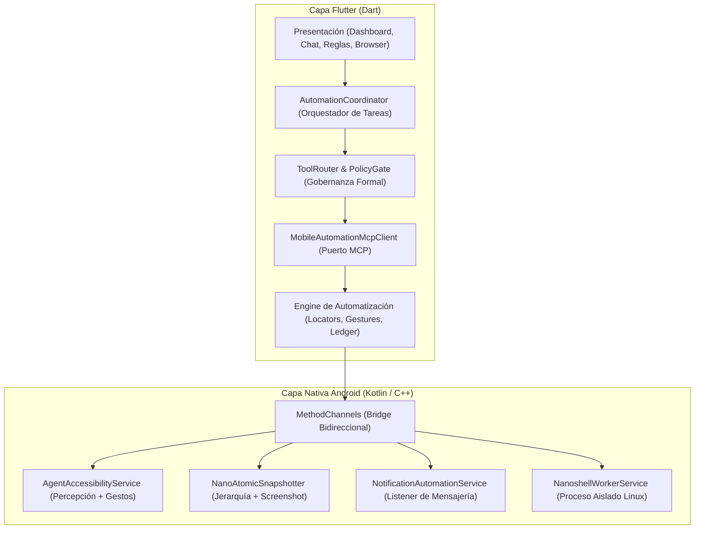

# nanoMOBILE: Plataforma Móvil y Motor de Automatización

`nanoMOBILE` es la plataforma móvil oficial de Nano para Android, construida sobre **Flutter** e integrada a bajo nivel con **Kotlin y JNI** para ejecutar agentes autónomos con percepción y acción directa en el sistema operativo.

---

## 1. Arquitectura de nanoMOBILE



---

## 2. Subsistemas Clave

### A. Motor de Automatización Móvil (`lib/features/automation/engine/`)
- **MCP Client (`mcp/mobile_automation_mcp_client.dart`)**: Cliente estándar MCP local con handshake real y verificación de Binder activo.
- **Catálogo de Herramientas (`mcp/mobile_automation_tool_catalog.dart`)**: Define 8 herramientas nativas (`observe`, `tap`, `type`, `swipe`, `press_key`, `launch_app`, `verify`, `get_ledger_history`).
- **Ejecución y Verificación (`mcp/mobile_gesture_executor.dart`)**: Aplica la regla `EXECUTED ≠ VERIFIED`: si el gesto se despacha pero la pantalla no cambia, la operación falla.
- **Localizador Multicapa (`perception/composite_locator.dart`)**: Búsqueda en cascada: `resourceId` unívoco → texto semántico → OCR visual → coordenadas.
- **Memoria Operativa (`memory/nano_transcript_ledger.dart`)**: Historial podado con retención de los últimos 2 pasos para no sobrecargar el contexto.
- **Gobernanza de Datos (`governance/nano_sensitive_data_policy.dart`)**: Detección y redacción automática de contraseñas, PINs y OTPs.

### B. Agente de Mensajería Inteligente
- Captura de notificaciones de WhatsApp vía `NotificationListenerService`.
- Deduplicación temporal y delimitación de ráfagas (`BurstTurnGate`).
- Clasificación pragmática (FastPath determinista vs inferencia LLM local).
- Respuestas respetuosas del tono del usuario sin bucles conversacionales.

### C. Navegador Web Integrado con PiP (`lib/features/browser/`)
- WebViews multi-pestaña con carrusel 3D, búsqueda en página, inyección segura de scripts y modo Picture-in-Picture.

---

## 3. Pruebas y Validación

```bash
# Pruebas unitarias y de arquitectura
flutter test test/features/automation/

# Pruebas en dispositivo físico Android
flutter test integration_test/nano_mobile_engine_device_test.dart -d <device_id>
```

---

## 4. Reglas de Calidad
- **Límite de Líneas**: Ningún archivo del subsistema supera las 300 líneas de código.
- **Arquitectura Limpia**: Desacoplamiento estricto, inversión de dependencias y 100% SOLID.
